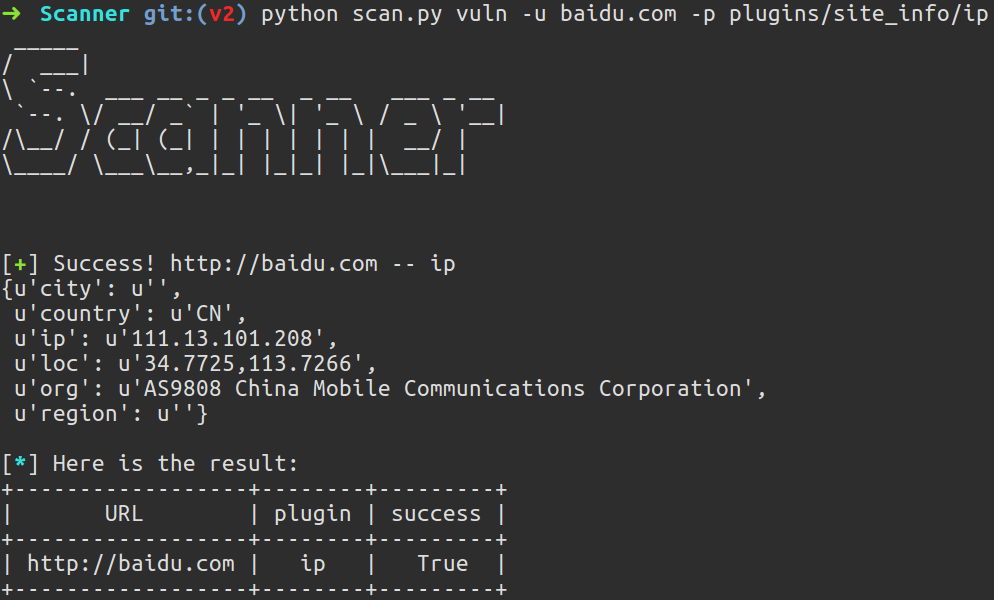

# Scanner 

[](https://www.python.org/)

端口扫描 + 敏感文件扫描 + PoC批量调用框架，可同时调用多个插件对多个目标进行检测。

## Installation

```bash
git clone https://github.com/imp0wd3r/Scanner
pip install -r requirements.txt
```

**注**：由于Masscan需要root权限运行，所以非root用户还需要使用`sudo pip install -r requirements.txt`来为root安装相关依赖。

在`config.py`中配置[Masscan](https://github.com/robertdavidgraham/masscan)、[Nmap](https://nmap.org/)和[MongoDB](https://www.mongodb.com/)：

```python
MASSCAN_BIN = '/opt/masscan/bin/masscan'
MASSCAN_RESULT_XML = '/tmp/result.xml'
MASSCAN_RATE = 100
MASSCAN_RETRIES = 2
MASSCAN_WAIT = 5

NMAP_BIN = '/usr/local/bin/nmap'
NMAP_ARGS = '-A --host-timeout 30s'

MONGODB_URI = 'mongodb://localhost:27017'
MONGODB_DATABASE = 'scanner'
MONGODB_PORT_COLLECTION = 'port'
MONGODB_VULN_COLLECTION = 'vuln'
MONGODB_SENS_COLLECTION = 'sens'
```

## Usage

```
➜  Scanner git:(master) python scan.py -h
 _____                                 
/  ___|                                
\ `--.  ___ __ _ _ __  _ __   ___ _ __ 
 `--. \/ __/ _` | '_ \| '_ \ / _ \ '__|
/\__/ / (_| (_| | | | | | | |  __/ |   
\____/ \___\__,_|_| |_|_| |_|\___|_|   
                                       
                                       

usage: scan.py [-h] {port,vuln,sens} ...

My vulnerability testing framework.

positional arguments:
  {port,vuln,sens}  Choose scan pattern
    port            Port scan via Masscan
    vuln            Vulnerability scan via plugins
    sens            Sensitive dir/file scan

optional arguments:
  -h, --help        show this help message and exit

```

根据命令行参数选择扫描模式

### 端口扫描

```
➜  Scanner git:(master) python scan.py port -h
 _____                                 
/  ___|                                
\ `--.  ___ __ _ _ __  _ __   ___ _ __ 
 `--. \/ __/ _` | '_ \| '_ \ / _ \ '__|
/\__/ / (_| (_| | | | | | | |  __/ |   
\____/ \___\__,_|_| |_|_| |_|\___|_|   
                                       
                                       

usage: scan.py port [-h] (-p PORTS | --port-file PORT_FILE)
                    (-t HOSTS | --host-file HOST_FILE) [-o OUTPUT] [--db]

Port scan via Masscan

optional arguments:
  -h, --help            show this help message and exit
  -p PORTS, --ports PORTS
                        Target ports (eg: 80,443,445...)
  --port-file PORT_FILE
                        Port file
  -t HOSTS, --hosts HOSTS
                        Target hosts (eg: 192.168.1.1/24,192.168.2.1)
  --host-file HOST_FILE
                        Host file

output:
  -o OUTPUT, --output OUTPUT
                        Save result to a json file
  --db                  Save to MongoDB in config.py

```

### 漏洞扫描（调用PoC插件）

```
➜  Scanner git:(master) python scan.py vuln -h
 _____                                 
/  ___|                                
\ `--.  ___ __ _ _ __  _ __   ___ _ __ 
 `--. \/ __/ _` | '_ \| '_ \ / _ \ '__|
/\__/ / (_| (_| | | | | | | |  __/ |   
\____/ \___\__,_|_| |_|_| |_|\___|_|   
                                       
                                       

usage: scan.py vuln [-h] (-u URL | -f URL_FILE)
                    (-p PLUGIN | -d PLUGIN_DIRECTORY) [--cookies COOKIES]
                    [--user-agent USER_AGENT] [--random-agent] [--proxy PROXY]
                    [--threads THREADS] [--extra-params EXTRA_PARAMS]
                    [-o OUTPUT] [--db]

Vulnerability scan via plugins

optional arguments:
  -h, --help            show this help message and exit
  -u URL, --url URL     Target URL
  -f URL_FILE, --file URL_FILE
                        URL file
  -p PLUGIN, --plugin PLUGIN
                        Plugin file
  -d PLUGIN_DIRECTORY, --directory PLUGIN_DIRECTORY
                        Load plugins from a directory

request:
  --cookies COOKIES     HTTP cookies (eg: "{'PHPSESSIONID': 'admin'}")
  --user-agent USER_AGENT
                        HTTP User-Agent header value
  --random-agent        Use randomly selected HTTP User-Agent header value
  --proxy PROXY         Use a proxy to connect to the target URL
  --threads THREADS     Max number of concurrent HTTP(s) requests (default 5)
  
extra_params:
  --extra-params EXTRA_PARAMS
                        Extra params for plugins (eg: "{'user':'xxx',
                        'pass':'xxx'}")

output:
  -o OUTPUT, --output OUTPUT
                        Save result to a json file
  --db                  Save to MongoDB in config.py

```

### 敏感文件扫描

```
➜  Scanner git:(master) python scan.py sens -h
 _____                                 
/  ___|                                
\ `--.  ___ __ _ _ __  _ __   ___ _ __ 
 `--. \/ __/ _` | '_ \| '_ \ / _ \ '__|
/\__/ / (_| (_| | | | | | | |  __/ |   
\____/ \___\__,_|_| |_|_| |_|\___|_|   
                                       
                                       

usage: scan.py sens [-h] (-u URL | -f URL_FILE) -w WORDLIST
                    [--cookies COOKIES] [--user-agent USER_AGENT]
                    [--random-agent] [--proxy PROXY] [--threads THREADS]
                    [--timeout TIMEOUT] [-o OUTPUT] [--db]

Sensitive dir/file scan

optional arguments:
  -h, --help            show this help message and exit
  -u URL, --url URL     Target URL
  -f URL_FILE, --file URL_FILE
                        URL file
  -w WORDLIST, --wordlist WORDLIST
                        Wordlist

request:
  --cookies COOKIES     HTTP cookies (eg: "{'PHPSESSIONID': 'admin'}")
  --user-agent USER_AGENT
                        HTTP User-Agent header value
  --random-agent        Use randomly selected HTTP User-Agent header value
  --proxy PROXY         Use a proxy to connect to the target URL
  --threads THREADS     Max number of concurrent HTTP(s) requests (default 5)
  --timeout TIMEOUT     Request timeout

output:
  -o OUTPUT, --output OUTPUT
                        Save result to a json file
  --db                  Save to MongoDB in config.py

```

## Examples

### 端口扫描

**注**：Masscan需要使用sudo或root权限执行

端口扫描首先使用Masscan扫描开放的端口，然后用Nmap针对这些开放的端口进行服务识别。

指定端口和目标：

```bash
sudo python scan.py port -p 80,443 -t 192.168.1.0/24
```

扫描UDP端口：

```bash
sudo python scan.py port -p 'U:53' -t 114.114.114.114
```

从文件读取端口和目标：

```bash
sudo python scan.py port --port-file /tmp/ports.txt --host-file /tmp/hosts.txt
```

目标为IP地址或IP段，不可为域名，更多端口及目标格式详见 https://github.com/robertdavidgraham/masscan/wiki

### 漏洞扫描

插件示例：

```python
from urlparse import urlparse

import redis

from scanner.libs.result import prepare_result


def poc(url, params):
    r = redis.Redis(urlparse(url).netloc, port=6379, socket_connect_timeout=5)
    if r.ping():
        return prepare_result(url, True, {'netloc': urlparse(url).netloc, 'port': 6379})
    else:
        return prepare_result(url, False)

```

编写一个`poc`函数：

- 参数`url`为目标url，如果输入为a.com或http://a.com ，则参数`url`的值为http://a.com ，如果输入为https://a.com ，其值为https://a.com 。
- 参数`params`为通过`--extra-params`传入的额外参数。
- 检测结果通过`prepare_result`函数返回，第一个参数为目标url，第二个参数为检测是否成功，第三个参数为检测过程中获取的数据。

调用单个插件对多个目标进行检测：

```bash
python scan.py vuln -f url.txt -p plugins/redis_unauth -o /tmp/result.json
```

**注**：`-p`后的插件名字不要带`.py`后缀

调用多个插件对多个目标进行检测：

```bash
python scan.py vuln -f url.txt -d plugins/site_info -o /tmp/result.json
```

### 敏感文件扫描

```bash
python scan.py sens -f urls.txt -w wordlist.txt --threads 10
```

## Screenshot

端口扫描：


漏洞扫描：



敏感文件扫描：


## Reference

https://github.com/knownsec/Pocsuite

https://github.com/mitsuhiko/pluginbase

https://github.com/robertdavidgraham/masscan